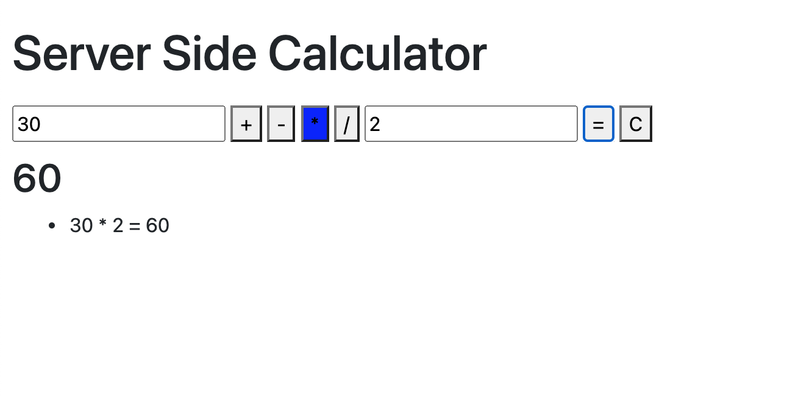

# jQuery Server Calculator

## Description

*Duration: 1 Week*

In this project a user can input two values (2 input elements) and select add ( + ), subtract ( - ), multiply ( * ) or divide( / ). When the submit ( = ) button is clicked, the inputs are captured and sent to the server for calculation via POST. A GET request is then performed to append the results to the DOM. There is a clear ( 'C' ) button that will clear inputs and the selected operator. A history of all calculations is displayed on the DOM.

## Screen Shot

### Prerequisites

- Node.js

## Installation

1. Fork and clone project
2. Open with the editor of your choice
3. Open terminal and run npm install
4. Run node server/server.js or npm start in your terminal
5. Open up a browser of your choice
6. Visit http://localhost:5000

## Usage

Interactive like a calculator

1. Type a number value in the first input
2. Select the operator to use
3. Type a number value in the second input
4. Click on the ( = ) button to see results
5. Click on the 'C' button to clear input area.
6. History of previous calculations will display on the DOM

## Built With

- Node.js
- Express
- jQuery
- HTML
- CSS

## Acknowledgement

Thanks to Prime Digital Academy who equipped and helped me to make this application a reality.

## Support

If you have suggestions or issues, please email me at terry.okeefe87@gmail.com
